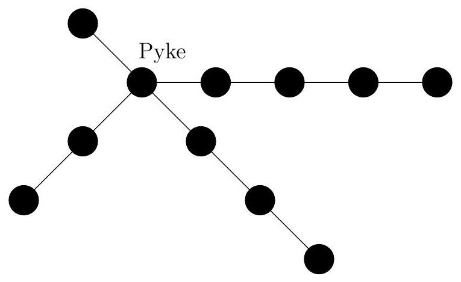

---
Eidgenössische Technische Hochschule Zürich Swiss Federal Institute of Technology Zurich Algorithms Lab HS22

Department of Computer Science

Prof. Dr. A. Steger, Prof. Dr. E. Welzl cadmo.ethz.ch/education/lectures/HS22/algolab
---

# Exercise - The Iron Islands

>  Ironborn captains were proud and willful, and did not go in awe of a man's blood. The islands were too small for awe, and a longship smaller still. If every captain was a king aboard his own ship, as was often said, it was small wonder they named the islands the land of ten thousand kings."

*Theon Greyjoy, A Song of Ice and Fire by George R. R. Martin*

After being freed by Theon, Yara Greyjoy decides to take the Iron Islands back from the hands of her uncle, Euron. While most of Euron's men are busy ferrying the Golden Company to King's Landing, some have been left back to protect the Iron Islands.

You want to help Yara plan the first strike, to conquer some of the islands. For every island you know exactly how many men are needed to conquer it. You should take into account that the ironborn (the members of Yara's army) are brave but stubborn men. Firstly, being left behind would be a grave insult and so they would refuse any plan that does not involve sending every single one of them to the islands. Also, they would refuse any plan that sends more men than strictly necessary to any of the islands—or do you doubt their skills?

Apart from this, you must also take the topology of the Iron Islands into account. The Iron Islands are arranged on undirected waterways that all necessarily contain and start at Pyke (Island 0). Every island, other than Pyke, belongs to *exactly one such waterway*. You can only move between islands by going along these waterways. Once the first strike is over, Yara wants to personally verify it’s success. She wants to traverse all attacked islands without having to visit any island more than once (as this would be a waste of time!) or having to go through an unattacked island (as this would be unsafe!). Of course, this traversal must respect the topology of the Iron Islands.

Figure 1: A possible topology of the Iron Islands with four waterways.

A *plan* for the first strike is a set of islands, which may or may not include Pyke. A plan is said to be *valid* if all aforementioned conditions are fulfilled. That is, a *valid plan* is a set of islands that require a total of all of Yara's men to be conquered, and such that the islands in the plan can be traversed along the waterways without visiting unattacked islands or any island more than once. Note that, naturally, once some soldiers have been deployed to attack an island, they cannot be recalled into an attack on another island. You want to know the maximum number of islands you can conquer with a *valid plan*.

**Input** The first line of the input contains the number $t \leqslant 30$ of test cases. Each of the $t$ test cases is described as follows.

- It starts with a line that contains three integers $n\ k\ b$, separated by a space. They denote 
  - $n$, the number of islands $\left(1 \leqslant n \leqslant 5 \cdot 10^{4}\right)$;
  - $k$, the number of ironborn men at your disposal $\left(1 \leqslant k \leqslant 10^{6}\right)$;
  - $w$, the number of waterways that start at Pyke $(1 \leqslant w<n)$.

- The following line contains $n$ integers $c_{0} \ldots c_{n-1}$, separated by a space, where $c_{i}$ denotes the number of men required to conquer island $i\left(1 \leqslant c_{i} \leqslant 10^{6}\right)$.

- The following $w$ lines each define a waterway. Each line starts with an integer $\ell$, followed by $\ell$ integers, $r_{0} r_{1} \ldots r_{\ell-1}$, separated by a space, which represent the length of the waterway $(1 \leqslant \ell \leqslant n)$ and the islands along this waterway $\left(r_{0}=0\right.$ and $1 \leqslant r_{i} \leqslant n-1$, for all $i \in\{1, \ldots, \ell\})$.

**Output** For each test case, output a single line that consists of a single integer denoting the maximum number of islands that can be conquered with a *valid plan* or 0 if there is no such plan.

**Points** There are four groups of test sets, each of which is worth 20 points. For each group there is also a corresponding hidden test set that is worth 5 points. So, there are $4 \cdot 20+4 \cdot 5=100$ points in total.

1. For the first group of test sets, you may assume that $w \leqslant 2$.

2. For the second group of test sets, you may assume that $w \leqslant 20$.

3. For the third group of test sets, you may assume that among the valid plans that conquer the maximum number of islands, at least one has the following property: all islands that it conquers belong to the same waterway, except for at most one island (other than Pyke) that may belong to a different waterway.

4. For the fourth group of test sets, there are no additional assumptions.

Corresponding sample test sets are contained in testi.in/out, for $i \in\{1,2,3,4\}$.

Sample Input

$$
\begin{array}{llllll}3 & & & & \\ 3 & 7 & 1 & & \\ 3 & 7 & 4 & & \\ 3 & 0 & 1 & 2 \\ 4 & 5 & 2 & & \\ 2 & 2 & 2 & 2 \\ 2 & 0 & 1 & \\ 3 & 0 & 2 & 3 \\ 6 & 6 & 3 & & \\ 2 & 2 & 2 & 1 & 1 & 1 \\ 2 & 0 & 1 & & & \\ 2 & 0 & 2 & & & \\ 4 & 0 & 3 & 4 & 5\end{array}
$$

Sample Output

$$
1 \\
0 \\
4
$$