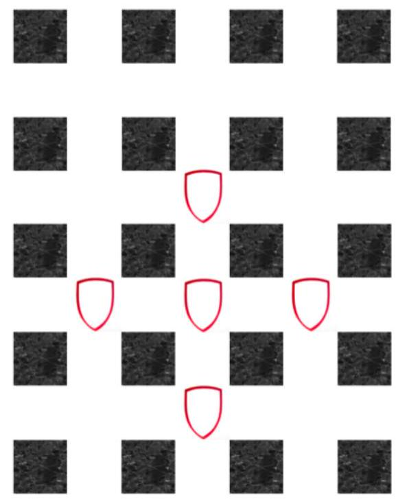

---
Eidgenössische Technische Hochschule Zürich Swiss Federal Institute of Technology Zurich Algorithms Lab HS22

Department of Computer Science Prof. Dr. A. Steger, Prof. Dr. E. Welzl cadmo.ethz.ch/education/lectures/HS22/algolab
---

# Exercise - Knights

After the Black Beast of Aaauugh has met its untimely demise in the middle of the cave of Caerbannog, the knights of the round table needed to leave the cave in order to continue their journey to the Castle of Uugggggh.

As in any proper movie however, the cave was destroyed; every hallway segment and every intersection collapsed after a few knights ran through. On the way to the Gorge of Eternal Peril, Sir Bedevere was wondering why only so few knights made it out of the cave alive and if they couldn't have ran through the hallways in such a way that more of them would have survived.

**Problem** Surprisingly, the cave of Caerbannog has a grid graph layout, where all the north-south hallways (columns) are numbered 0 to $m-1$ (from west to east), while the west-east hallways (rows) are numbered 0 to $n-1$ (from north to south). All hallways are connected to the outside on their ends. Knights start at the intersections given in the input file. *You may assume that no two knights start at the same intersection.*

Every segment of a hallway that a knight passes through will collapse immediately behind him, in a movie-like fashion. Intersections have a more heavyweight construction: an intersection collapses immediately after $\mathrm{C}$ knights have been there. Because two knights never arrive at an intersection at exactly the same time, every hallway segment can only be used by a single knight and every hallway intersection by at most $C$ knights.

Find out how many knights can get to safety.

Figure 1: 3 columns, 4 rows, 5 knights (sample inputs)

**Input** The first line of the input contains $t \leqslant 30$, the number of test cases. Each of the $t$ test cases is described as follows:

- It starts with a line that contains four numbers: $m\ n\ k\ C$, separated by a space. They denote

  - $0 \leqslant m, n \leqslant 50$, the number of columns and rows of the cave,

  - $k$, the number of knights in the cave,
  - $C \leqslant 4$, the maximum number of knights that can use the same intersection.

- The next line contains $2 k$ numbers, with the $2 i$-th and $(2 i+1)$-th numbers denoting the $x$ (column) and $y$ (row) coordinates of the starting position of the knight $i$ in the cave, i.e. $0 \leqslant x \leqslant m-1,0 \leqslant y \leqslant n-1$. No two knights start at the same intersection.

**Output** For every test case output a single line containing the maximum number of knights that can escape from the cave.

**Points** There are three groups of test sets which are worth 100 points in total.

1. For the first group of test sets and the corresponding hidden test sets, worth 35 and 5 points, you may assume that $\mathrm{C}=2$.

2. For the second group of test sets and the corresponding hidden test sets, worth 35 and 5 points, you may assume that $\mathrm{C}=1$.
   This means that every hallway intersection can only be used by a single knight. Note that the hallway intersection the knight starts in collapses immediately.

3. For the third group of test sets and the corresponding hidden test sets, worth 10 and 10 points, there are no further assumptions.

Corresponding sample test sets are contained in test $i$. in/out, for $i \in\{1,2,3\}$.
