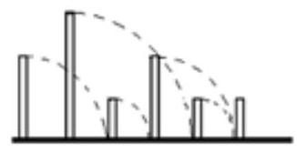

---
Eidgenössische Technische Hochschule Zürich Swiss Federal Institute of Technology Zurich Algorithms Lab HS22

Department of Computer Science

Prof. Dr. A. Steger, Prof. Dr. E. Welzl cadmo.ethz.ch/education/lectures/HS22/algolab
---

# Exercise - Dominoes

Playing with dominoes is a lot of fun. You can, for example, place them in long lines so that when the first tile is toppled, it topples the second, which topples the third, etc., resulting in all of the tiles falling.

In this problem, you are dealing with a special kind of domino set, in which the tiles are of different heights. Your task is to determine, given an arrangement of these tiles in a line, how many of the domino tiles will fall after toppling the left-most domino.

More precisely, we have the following set-up: the dominoes are placed at successive points on the integer line, the first at position 1 , the second at 2 , and so on. If a tile of height $h$ at position $i$ is toppled, this causes the tiles at all positions $j>i$ such that $j-i<h$ to fall as well.

**Input** The first line of the input contains the number $t \leqslant 10$ of test cases. Each of the t test cases is described as follows.

- It starts with a line containing an integer $n$ denoting the number of dominoes $(1 \leqslant n \leqslant$ $\left.10^{6}\right)$

- The following line contains $n$ integers $h_{0} \ldots h_{n-1}$, separated by a space, where $h_{i}$ denotes the height of the domino placed at the $(i+1)$-st position $\left(1 \leqslant h_{i}<2^{31}\right)$.

**Output** For each test case output a single line that consists of a single integer denoting the number of domino tiles that will fall after toppling the left-most tile.

**Points** There are two groups of test sets, worth 100 points in total.

1. For the first group of test sets, worth 50 points, you may assume that $n \leqslant 10^{3}$.

2. For the second group of test sets, worth 50 points, there are no additional assumptions.

Corresponding sample test sets are contained in testi.in/out, for $i \in\{1,2\}$. 