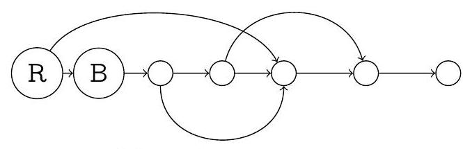
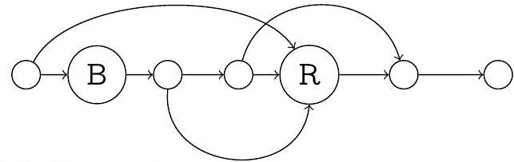
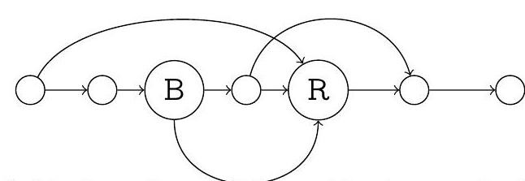
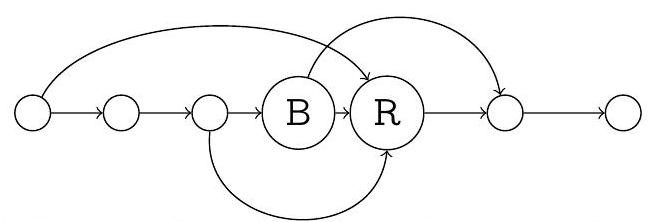
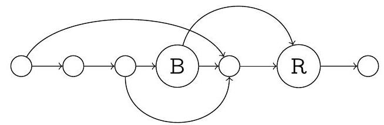
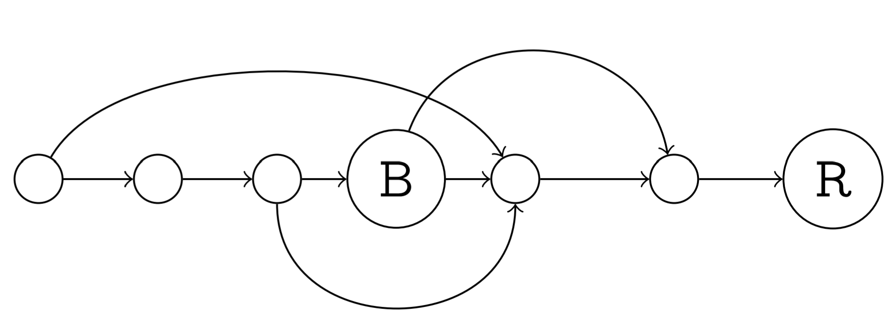

---
Eidgenössische Technische Hochschule Zürich Swiss Federal Institute of Technology Zurich Algorithms Lab HS22

Department of Computer Science

Prof. Dr. A. Steger, Prof. Dr. E. Welzl cadmo.ethz.ch/education/lectures/HS22/algolab
---

# Exercise - The Great Game

Smart as they are—and gentlemen along the way—Sherlock Holmes and Professor Moriarty have decided to settle the scores by playing *The Great Game*.

The Great Game is played on a board with $n$ positions, labelled from 1 to $n$. Some positions are connected via a transition. Every transition goes from a position with a lower label to a position with a higher label. The position labelled $n$ is called target position.

Holmes and Moriarty alternate in making moves. There are two meeples on the board, red and black. Each move consists of moving one meeple along exactly one transition. If Holmes has played an even number of times so far, then in his next turn he moves the red meeple; otherwise, he moves the black meeple. Similarly, if Moriarty has played an even number of times so far, then in his next turn he moves the black meeple; otherwise, he moves the red meeple (see the example described on the next page). Holmes has the first move (thus moving the red meeple). The game ends as soon as one of the meeples reaches the target position. If the red meeple reaches the target position, then Holmes wins; if it is the black meeple, then Moriarty wins. You may assume that the target position is reachable from every position via a sequence of transitions. It follows that the game always ends with either Moriarty's or Sherlock's win.

Given the board and the starting positions of the two meeples, your job is to determine who has a winning strategy. A player has a winning strategy, if he can win no matter how the other player plays. As the game cannot end in a draw, exactly one player has a winning strategy.

Remark: The two meeples are allowed to be at the same position.

**Input** The first line of the input contains the number $t \leqslant 200$ of test cases. Each of the $t$ test cases is described as follows.

- It starts with a line that contains two integers $\mathrm{n} \mathrm{m}$, separated by a space, and such that $2 \leqslant n \leqslant 10^{5}$ and $1 \leqslant m \leqslant 2 \cdot 10^{5}$. Here $n$ denotes the number of positions on the table and $m$ denotes the number of transitions.

- The following line contains two integers $r$ b, separated by a space, and such that $1 \leqslant$ $r, b \leqslant n-1$. Here $r$ denotes the starting position of the red meeple and $b$ denotes the starting position of the black meeple.

- The following $m$ lines define the $m$ transitions. Each transition is defined by two integers $u, v$, separated by a space, and such that $1 \leqslant u<v \leqslant n$, which indicates that there exists a transition from position $u$ to position $v$.

Between every pair of positions there is at most one transition.

**Output** For each test case output a single line with one character 0 or 1 . For each test case output 0, if Sherlock has a winning strategy, and 1, if Moriarty has a winning strategy. 

(a) Initial position.

(b) Sherlock's 1st move - red meeple.

(c) Moriarty's 1st move - black meeple. 

(d) Sherlock's 2nd move - black meeple.

(e) Moriarty's 2nd move - red meeple.

(f) Sherlock's 3rd move - red meeple.

Figure 1: Example game for the second test case.

Points We say that a sequence of positions $p_{1}, p_{2}, \ldots, p_{k-1}, p_{k}$ is a path from $p_{1}$ to $p_{k}$ if there is a transition from $p_{i}$ to $p_{i+1}$, for every $i \in\{1, \ldots, k-1\}$.

There are four groups of test sets, worth 100 points in total.

1. For the first group of test sets, worth 25 points, you may assume $2 \leqslant n \leqslant 50$ and $1 \leqslant m \leqslant 50$. Moreover, there is a unique path from $r$ to $n$ and at most two different paths from $b$ to $n$.

2. For the second group of test sets, worth 25 points, you may assume $2 \leqslant n \leqslant 100$ and $1 \leqslant m \leqslant 100$. Moreover, there is a unique path from $r$ to $n$ and at most six different paths from $b$ to $n$.

3. For the third group of test sets, worth 25 points, you may assume $2 \leqslant n \leqslant 2 \cdot 10^{3}$ and $1 \leqslant m \leqslant 2 \cdot 10^{3}$. Moreover, there is a unique path from $r$ to $n$ and no additional assumptions on paths from $b$ to $n$.

4. For the forth group of test sets, worth 25 points, there are no additional assumptions.

Remark: two different paths between positions $u$ and $v$ can intersect at positions beside $u$ and $v$

Corresponding sample test sets are contained in testi.in/out, for $i \in\{1,2,3,4\}$.

Sample Input