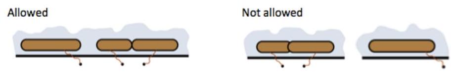

---
Eidgenössische Technische Hochschule Zürich Swiss Federal Institute of Technology Zurich Algorithms Lab HS22

Department of Computer Science

Prof. Dr. A. Steger, Prof. Dr. E. Welzl cadmo.ethz.ch/education/lectures/HS22/algolab
---

# Exercise - Boats

Every year all the wizards of the world gather at the Algwarts School of Magic to celebrate the fact that their magic is still not replaced by science.

They can come with boats, among other ways. The organizers have reserved a ring for every participant, so he can tie his boat to the ring assigned uniquely to him. Every magician has sent the length of his boat to the organizers. The boat has to be tied so that the ring is somewhere on the length of the boat, including the endpoints of the boat. The ends of two boats can touch each other, but boats cannot overlap (see the picture). Because of this restriction it is possible that all boats cannot be tied at the same time.

The organizing committee of the Wizard Assembly asked you to write the program BOATS that finds the maximal number of boats which can be tied at the same time to the assigned ring.

**Input** The first line of the input contains the number $t \leqslant 30$ of test cases. Each of the $t$ test cases is described as follows.

- It starts with a line that contains a single integer $\mathrm{n}$, denoting the number of wizards $\left(1 \leqslant n \leqslant 2 \cdot 10^{5}\right)$

- The following $n$ lines define the boats. The $i$-th such line contains two integers $l\ p$, separated by a space, denoting the length of the i-th boat $\left(1 \leqslant \ell \leqslant 10^{6}\right)$ and the position of the assigned ring along the river bank starting from the school building $\left(1 \leqslant p \leqslant 10^{6}\right)$. No two rings have the same position. While the positions of the rings are always positive, the left endpoint of the boats can be negative.

**Output** For each test case, on a single line output the maximal number of boats that can be attached to their ring without collisions.

**Points** There are two groups of test sets, worth 100 points in total.

- For the first group of test sets, worth 30 points, you may assume that $n \leqslant 10^{3}$ and that $\ell, p \leqslant 5 \cdot 10^{3}$.

- For the second group of test sets, worth 30 points, you may assume that $n \leqslant 10^{3}$.

- For the third group of test sets, worth 40 points, there are no additional assumptions.

Corresponding sample test sets are contained in testi.in/out, for $i \in\{1,2,3\}$. 