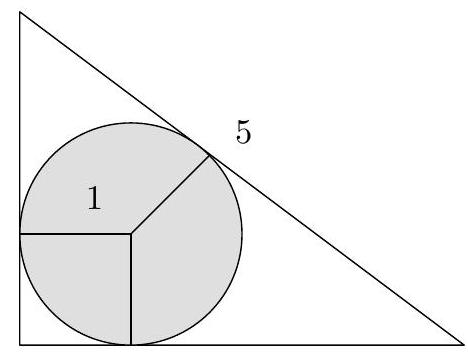

---
Eidgenössische Technische Hochschule Zürich Swiss Federal Institute of Technology Zurich Algorithms Lab HS22

Department of Computer Science

Prof. Dr. A. Steger, Prof. Dr. E. Welzl cadmo.ethz.ch/education/lectures/HS22/algolab
---

# Exercise - Inball

The many-dimensional country of Ballland experienced a natural disaster and all its inhibitants have to seek shelter in its sophisticated system of underground caves. Unfortunatelly, some of the inhabitants of the Ballland have grown quite large (they are ball-shaped, indeed), it is necessary to figure out, how large inhabitants cave can still be accomodated in each cave. Each cave $C$ is of a polyhedral shape, i.e., is described by $n$ linear inequalities

$$
C=\left\{x \in \mathbb{R}^{d} \mid a_{i}^{\top} x \leqslant b_{i}, i=1, \ldots, n\right\},
$$

where $a_{i} \in \mathbb{R}^{d}, b_{i} \in \mathbb{R}$. Here $a_{i}^{\top} x$ denotes the standard scalar product of $a_{i}$ and $x$, i.e., $a_{i}^{\top} x:=\sum_{j=1}^{d}\left(a_{i}\right)_{j} x_{j}$

**Input** The input contains several test cases. Each test case describes one cave. It begins with a line containing two integers $n$ and $d\left(1 \leqslant d \leqslant 10,1 \leqslant n \leqslant 10^{3}\right)$ where $n$ is the number of inequalities describing the cave and $d$ is its dimension.

Each subsequent line describes one inequality $a_{i}^{\top} x \leqslant b_{i}$ and consist of $d+1$ space separated integers $\left(a_{i}\right)_{1}\left(a_{i}\right)_{2} \ldots\left(a_{i}\right)_{d} b_{i}\left(-2^{10} \leqslant\left(a_{i}\right)_{1}, \ldots,\left(a_{i}\right)_{d}, b_{i} \leqslant 2^{10}\right)$. It is guaranteed, that the norm $\left\|a_{i}\right\|_{2}=\sqrt{\sum_{j=1}^{d}\left(\left(a_{i}\right)_{j}\right)^{2}}$ of each $a_{i}$ is an integer.

The input is terminated by a line containing a single value 0 .

**Output** For each input, the output appears on a single and separate line. This line consists of a single integer $r$ denoting the maximum integral radius of a d-dimensional ball, which fits into the cave. If the cave is an empty set, the word none is to be printed. If an arbitrarily large ball can be fit into the cave, the word `inf` should be printed.

