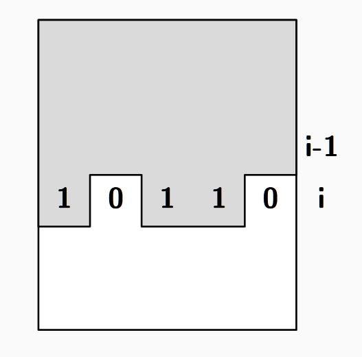
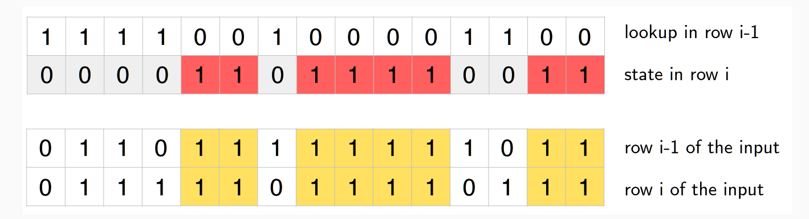

# Solution

## Wrong Basic Idea

Just choosing the square, which blocks the least other squares is not a solution, as can be seen from this example:

```
11110
11111
11111
11110
```

## Correct Solution

We look at bitmasks: $j$-th bit is 1 iff $j$-th column may be used (regardless of the input)

**State of the subproblem:** [$i$, $bitmask$], $1 ≤ i ≤ h$, $0 ≤ bitmask ≤ 2^w − 1$

$DP [i][bitmask] :=$ maximum number of 2x2 matrices we can place on top of the first $i$ rows
where the $i$-th row is constrained to the $bitmask$.



Initialization:

-  In a single row, no tiles fit: $DP [1][bitmask] = 0$, for any $bitmask$
- If we do not use the new row at all: $DP [i]\underbrace{[00 . . . 0]}_w = \text{max}_{bitmask}(DP[i-1][bitmask])$

**Recurrent formula for placing new tiles:**

We have to take some $2 × 2$ matrices in the $i − 1, i$ strip



Try only those bitmasks that have even number of consecutive 1s.

All others are covered by removing single bits and not adding anything new.

Check whether this maximal amount of $2 × 2$ matrices is compatible with the input matrix. If yes, check whether this would lead to a larger tiling.
$$
DP [i][bitmask] &= 
\text{max}( \text{max}_{j∈{j | j-\text{th bit is set in }bitmask}}
 DP [i][bitmask\text{ with j}\text{-th bit unset}],\\
& DP [i − 1][\text{negated }bitmask] + bitcount(bitmask)/2)
$$
**Runtime:**

Size of the table: $2w · h$.

Update step per entry: two loops over $w$ (one in the initialization, one for the check).

Runtime: $O(2w · h · w)$, which is fast enough.

**Slower solution for first subtask:**

For smaller $w$, we could also check for a given bitmask all of its subsets, resulting in running
time $O(3w · w · h)$.